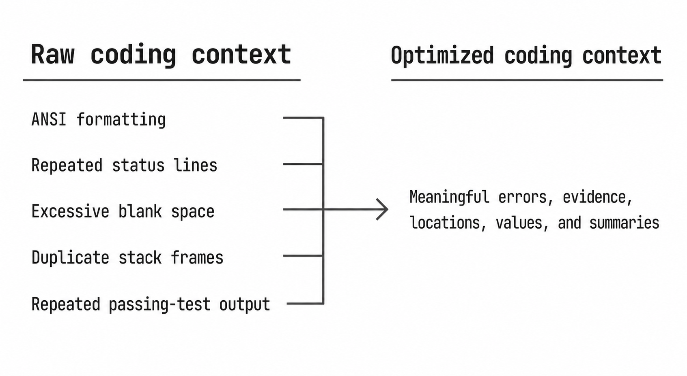
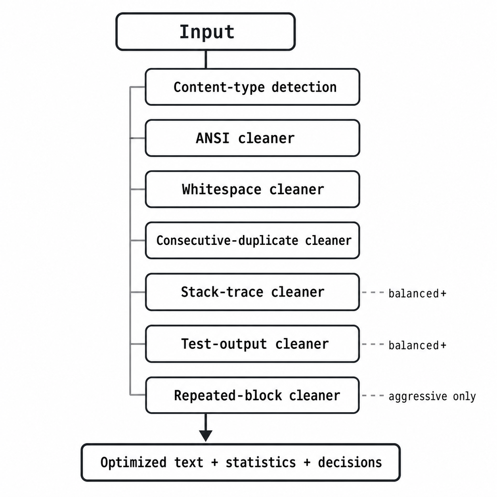

<div align="center">
  

  <h1>iritoken</h1>

  <p><strong>Spend tokens on answers, not terminal noise.</strong></p>

  <p>
    A deterministic, zero-runtime-dependency TypeScript toolkit that removes<br />
    low-value noise from AI coding context—locally, safely, and without an LLM.
  </p>

  <p>
    <a href="https://www.npmjs.com/package/iritoken"></a>
    <a href="https://github.com/lelianto/iritoken/actions/workflows/ci.yml"></a>
    <a href="LICENSE"></a>
    <a href="https://www.npmjs.com/package/iritoken"></a>
    
  </p>

  <p>
    <a href="#quick-start">Quick start</a> ·
    <a href="#cli">CLI</a> ·
    <a href="#library-api">API</a> ·
    <a href="#benchmarks">Benchmarks</a> ·
    <a href="#security">Security</a>
  </p>
</div>

---

AI coding workflows repeatedly send ANSI codes, duplicate logs, redundant stack
frames, test-runner noise, and excessive whitespace to language models.
`iritoken` removes that deterministic noise before it consumes context-window
space or API budget.

```text
same input + same configuration = same output
```

It makes no network requests, uses no model, needs no API key, and never
summarizes content. When a transformation is uncertain, the original
information is preserved.

## Table of contents

- [Why iritoken?](#why-iritoken)
- [Features](#features)
- [Quick start](#quick-start)
- [CLI](#cli)
- [Library API](#library-api)
  - [Presets](#presets)
  - [Cleaner overrides](#cleaner-overrides)
  - [Exact token measurement](#exact-token-measurement)
  - [Explainability and observability](#explainability-and-observability)
- [Integrations](#integrations)
  - [Chat messages](#chat-messages)
  - [Node streams](#node-streams)
- [How it works](#how-it-works)
- [Safety guarantees](#safety-guarantees)
- [Benchmarks](#benchmarks)
- [Security](#security)
- [Development](#development)
- [Project structure](#project-structure)
- [Contributing](#contributing)
- [License](#license)

## Why iritoken?

Raw tool output is useful, but it is rarely token-efficient. A typical agent
loop may resend the same noisy context several times. Even small deterministic
savings compound across prompts, retries, models, and users.

<p align="center">
  
</p>

`iritoken` is intentionally narrower than a summarizer. It removes patterns it
can verify mechanically and leaves unique content alone.

## Features

- **Deterministic:** reproducible output with no probabilistic model behavior.
- **Local and private:** no telemetry, network requests, storage, or API keys.
- **Zero runtime dependencies:** small supply-chain and installation footprint.
- **Conservative by default:** `safe` is the default preset.
- **Idempotent:** optimizing an optimized result produces the same text.
- **Non-expanding:** transformations never return more text than they receive.
- **Explainable:** every cleaner reports whether it ran, changed, or skipped.
- **Composable:** library API, Unix filter, JSON output, chat helpers, and streams.
- **Measured:** deterministic regression corpus plus live-model quality results.
- **Typed:** ESM TypeScript package with bundled declaration files.

## Quick start

### Install

```bash
npm install iritoken
```

Node.js 18 or newer is required.

### Optimize text

```ts
import { optimize } from "iritoken";

const result = optimize(rawContext, { preset: "balanced" });

console.log(result.text);
console.log(result.stats.reductionPercentage);
```

### Use it as a Unix filter

```bash
npm test 2>&1 | npx iritoken --preset balanced --stdout > context.txt
```

That is the core workflow: produce context, optimize it locally, then send the
result to the model or agent of your choice.

## CLI

```text
Usage:
  iritoken [file] [options]
  command | iritoken [options]

Options:
  -o, --output <path>   Write optimized text to a file
  --preset <name>       safe (default) | balanced | aggressive
  --stdout              Emit optimized text only
  --json                Emit a versioned machine-readable result
  --dry-run             Report statistics without writing output
  --explain             Explain the transformations
  --max-input-mb <n>    Override the 16 MiB input limit
  -q, --quiet           Suppress the report when using --output
  -h, --help            Show help
  -v, --version         Show version
```

### Common recipes

```bash
# Analyze a log without modifying it
iritoken build.log --dry-run

# Save optimized context securely
iritoken build.log --preset balanced --output build.optimized.log

# Compose with another command
npm test 2>&1 | iritoken --stdout | pbcopy

# Inspect machine-readable statistics
iritoken build.log --json | jq '.stats'

# Understand why cleaners changed or skipped the input
iritoken build.log --preset balanced --explain
```

`--stdout` writes only optimized text. Human reports never contaminate the
pipeline. `--json` uses a top-level `schemaVersion` so automation can validate
the response format.

## Library API

### `optimize(input, options?)`

```ts
import { optimize } from "iritoken";

const result = optimize("\u001b[31mERROR\u001b[0m\n\n\nDetails", {
  preset: "safe",
  maxInputCharacters: 2_000_000
});
```

The result contains optimized text and character statistics:

```ts
{
  text: "ERROR\n\nDetails",
  stats: {
    originalCharacters: 27,
    optimizedCharacters: 14,
    charactersRemoved: 13,
    reductionPercentage: 48.15,
    transformations: { ansi: 2, whitespace: 1 },
    detection: { type: "generic-terminal-output", confidence: "high" },
    decisions: [
      { cleaner: "ansi", enabled: true, changes: 2, reason: "applied" }
    ]
  }
}
```

### Presets

| Preset | Behavior | Recommended for |
| --- | --- | --- |
| `safe` | ANSI, whitespace, and consecutive exact duplicates | Default and unknown input |
| `balanced` | `safe` plus conservative stack and test-output cleanup | Coding-agent and CI context |
| `aggressive` | `balanced` plus repeated identical multiline blocks | Opt-in repetitive terminal output |

The published live-model quality result applies to `balanced`. The additional
aggressive block cleaner is deterministic and corpus-tested, but has not yet
received the same live-model validation.

### Cleaner overrides

Every cleaner can be enabled or disabled independently:

```ts
const result = optimize(context, {
  preset: "balanced",
  cleaners: {
    whitespace: false,
    testOutput: true,
    repeatedBlocks: false
  }
});
```

Available keys are `ansi`, `whitespace`, `duplicateLines`, `stackTrace`,
`testOutput`, and `repeatedBlocks`.

### Exact token measurement

Character statistics always work. Exact token statistics require the tokenizer
for the model you intend to use:

```ts
import { fromEncoder, optimize } from "iritoken";

const result = optimize(context, {
  tokenCounter: fromEncoder(modelEncoder)
});

console.log(result.stats.tokens);
```

Tokenizers exposing `tokenize()` can use `fromTokenizer()` instead. The
adapters are structural and introduce no dependency. Without a supplied
counter, the library does not claim exact model-token savings.

### Explainability and observability

`stats.decisions` records an outcome for every cleaner:

- `applied`
- `not-applicable`
- `disabled-by-preset`

For metrics, use synchronous metadata-only observer hooks. Input text is never
passed to the observer:

```ts
optimize(context, {
  observer: {
    onCleaner(decision) {
      metrics.increment(`iritoken.${decision.cleaner}.${decision.reason}`);
    },
    onComplete(stats) {
      metrics.observe("iritoken.reduction", stats.reductionPercentage);
    }
  }
});
```

## Integrations

### Chat messages

Optimize OpenAI-compatible message objects without coupling the package to any
provider SDK:

```ts
import { optimizeMessages } from "iritoken";

const { messages, stats } = optimizeMessages(request.messages, {
  preset: "balanced",
  roles: ["tool", "user"]
});
```

The input array is never mutated. By default, only `user` and `tool` messages
are optimized; system instructions and assistant messages are copied unchanged.

### Node streams

```ts
import { createReadStream, createWriteStream } from "node:fs";
import { pipeline } from "node:stream/promises";
import { createOptimizeTransform } from "iritoken/stream";

await pipeline(
  createReadStream("build.log"),
  createOptimizeTransform({
    preset: "balanced",
    maxInputBytes: 8 * 1024 * 1024
  }),
  createWriteStream("context.txt")
);
```

The transform honors backpressure and enforces a byte limit. It buffers input
up to that limit before emitting because content detection requires the full
context to remain exactly equivalent to `optimize()`.

See [the integration guide](docs/integrations.md) for additional examples.

## How it works

<p align="center">
  
</p>

| Cleaner | What it changes | What it preserves |
| --- | --- | --- |
| ANSI | CSI and OSC control sequences | Visible text |
| Whitespace | Trailing space and excessive blank lines | Indentation and meaningful alignment |
| Duplicates | Consecutive exact duplicate lines | One copy plus repetition count |
| Stack trace | Consecutive identical frames | Errors, unique frames, paths, line numbers |
| Test output | Repeated passing-test runs in fully passing reports | Failures, assertions, values, summaries |
| Repeated blocks | Three or more identical 2–8-line terminal blocks | One complete block plus repetition count |

Content is classified as terminal output, source code, stack trace, test
output, or unknown. Riskier transformations only run when their expected
content type is recognized.

## Safety guarantees

The implementation and regression suite enforce these invariants:

1. **Deterministic:** identical inputs and options produce identical outputs.
2. **Idempotent:** `optimize(optimize(x).text).text === optimize(x).text`.
3. **Non-expanding:** optimized text is never longer than the original.
4. **Bounded:** library and CLI inputs are limited by default.
5. **Conservative:** unique or ambiguous information is preserved.
6. **Content-blind telemetry:** observer hooks receive metadata, not source text.

Deterministic optimization does not mean semantic perfection. Evaluate the
chosen preset against your own corpus before inserting it into a critical
automated workflow.

## Benchmarks

Benchmarks are generated by running the real implementation against committed
fixtures. Compression is useful only when task quality survives.

### Current deterministic results

| Metric | Result |
| --- | ---: |
| Quality tasks | **10/10 → 10/10** |
| Success regression | **0 percentage points** |
| Estimated input tokens | **2,701 → 2,396** |
| Estimated token reduction | **11.3%** |
| Balanced corpus character reduction | **12.0%** |
| Corpus regression matrix | **10 tasks × 3 presets passed** |
| Unit and integration tests | **117/117 passed** |

The deterministic corpus includes npm, TypeScript, Vitest, Jest, stack traces,
repetitive logs, mixed agent context, Docker, Kubernetes, and Python failures.

### Live-model quality result

The latest quality-first run used `deepseek-v4-flash`, thinking disabled, five
trials, and 70 requests on the original seven-task suite:

| Metric | Original | Optimized |
| --- | ---: | ---: |
| API-reported input tokens | 22,840 | 19,695 |
| Fact recall | 83.2% | 85.2% |
| Complete tasks | 16/35 | 19/35 |

- Actual API token reduction: **13.77%**
- Paired mean quality change: **+2.14 percentage points**
- Task-cluster bootstrap 95% CI: **0.00 to +6.43 percentage points**
- Pre-registered −5pp non-inferiority margin: **passed**
- Recorded cost: approximately **$0.007438**

This result supports non-inferiority for that model, configuration, and task
suite—not every model or workload. The three newer fixtures have deterministic
coverage and should be included in the next live-model campaign.

### Performance

Latest balanced-preset run:

| Input | Time | Heap change | Throughput cost |
| --- | ---: | ---: | ---: |
| 10 KiB | ~2.2 ms | <1 MiB | ~227 ms/MiB |
| 100 KiB | ~3.7 ms | <1 MiB | ~38 ms/MiB |
| 1 MiB | ~32 ms | ~5 MiB | ~32 ms/MiB |
| 10 MiB | ~256 ms | ~83 MiB | ~26 ms/MiB |

See the [generated compression report](benchmark/results/REPORT.md) and
[quality methodology](docs/quality-benchmark.md) for fixtures, limitations,
historical results, and reproduction instructions.

### Reproduce locally

```bash
npm run benchmark -- balanced
npm run benchmark:quality
npm run benchmark:corpus
npm run benchmark:perf
npm run report
```

Live-provider benchmarks are intentionally separate and cost-capped:

```bash
npm run benchmark:groq -- --trials 1
npm run benchmark:deepseek -- --trials 1 --max-cost-usd 0.01
```

## Security

`iritoken` is a local text processor. It does not execute input, open sockets,
query databases, fetch URLs, parse sessions, or expose an HTTP server. SQL
injection, CSRF, and SSRF therefore have no direct attack surface in this
package.

Resource-exhaustion and filesystem protections include:

- 16 Mi-character library input limit by default
- 16 MiB CLI and stream input limit by default
- bounded stdin accumulation
- refusal to overwrite the input file
- refusal to write through output symlinks
- owner-only permissions for new CLI output files
- sanitized diagnostic messages

Applications exposing `iritoken` over HTTP must still implement authentication,
authorization, body/time limits, rate limiting, CSRF controls, SSRF protection,
parameterized database queries, and edge-level DDoS mitigation at their own
trust boundary.

Please report vulnerabilities privately using [SECURITY.md](SECURITY.md).

## Development

```bash
git clone https://github.com/lelianto/iritoken.git
cd iritoken
npm install

npm run build
npm run lint
npm run typecheck
npm test
npm run benchmark:verify
npm run pack:smoke
npm run release:check
```

GitHub Actions verifies Node.js 18, 20, and 22, audits production dependencies,
runs deterministic benchmarks, and installs the generated tarball before a
release can be published. The manual release workflow defaults to dry-run and
supports npm provenance.

## Project structure

```text
iritoken/
├── src/
│   ├── cleaners/          deterministic transformation stages
│   ├── detectors/         content-type detection
│   ├── integrations/      provider-neutral message helpers
│   ├── pipeline/          optimize() and presets
│   ├── stats/             character and token statistics
│   ├── token/             counters and tokenizer adapters
│   ├── cli/               command-line interface
│   ├── stream.ts          bounded Node Transform
│   └── index.ts           public API
├── test/                  unit, integration, security, and property tests
├── benchmark/             fixtures, tasks, live runners, and reports
├── docs/                  methodology and integration guides
└── .github/workflows/     CI and release gates
```

## Contributing

Contributions are welcome, especially new real-world fixtures, conservative
cleaners, tokenizer examples, and provider-neutral quality evaluations.

Before opening a pull request:

1. Add tests for normal, malformed, Unicode, large, unchanged, and repeated input.
2. Preserve determinism, idempotence, and non-expansion.
3. Add required facts to the benchmark manifest for new fixtures.
4. Run `npm run prepublishOnly` and `npm run benchmark:corpus`.
5. Do not commit API keys, `.env.local`, generated secrets, or model responses.

## License

Licensed under the [Apache License 2.0](LICENSE). Copyright attributed to dan.

<div align="center">
  <sub>Built to make every context window count.</sub>
</div>
